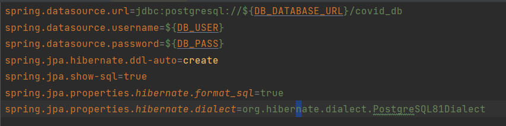

# Board_Perso_Back

## API (SpringBoot) + db PostgreeSQL 

Ceci est l'API d'un projet perso, une application présentant mes projets réalisés. 

Dépot git : `https://github.com/wsanon19/boardpersoback.git`

Lien de déploiement mogenius : `https://boardpersoback-prod-wilfried-bf-8a0qur.mo2.mogenius.io/`

## Endpoints fonctionnels de l'api  : 

- Afficher la liste des projets : 
    - Type de la requete : GET 
    - Chemin : `.../api/projet/list`

- Ajouter un projet dans la db :
    - Type de la requete : POST
    - chemin : `.../api/projet/save`
    - Body attendu (un projet) : 
        {
            "id": 2,
            "nom": "Dev Full Stack ",
            "description": "Ceci est le projet sur le cloud"
        }


## Mobogenius 

**Services crées**  


Deux services ont été crées. 

* boardpersoback : image crée a partir du dépos git `https://github.com/wsanon19/boardpersoback.git`

* covid_db : image créé a partir du services préconfigurés postgre sql fournie par mobogenius


**covid_db**  
Il s'agit de l'image de la base de donnée postgre crée avec les variables d'environnements suivants: 


**boardpersoback**  

Il s'agit du conteneur contenant l'API spring. Cette API communique avec la base de donnée sur le conteneur covid_db.
Afin de réaliser la connection à la base de données le fichier application.properties a été configuré de la manière 
suivante :




```

spring.datasource.url=jdbc:postgresql://${DB_DATABASE_URL}/covid_db
spring.datasource.username=${DB_USER}
spring.datasource.password=${DB_PASS}
spring.jpa.hibernate.ddl-auto=create
spring.jpa.show-sql=true
spring.jpa.properties.hibernate.format_sql=true
spring.jpa.properties.hibernate.dialect=org.hibernate.dialect.PostgreSQL81Dialect

```

Puis les variables d'environnements du conteneur sont configurées ainsi : 


## Informations perso 
### Nom : SANON Wilfried
### Numéro étudiant : 31828632

