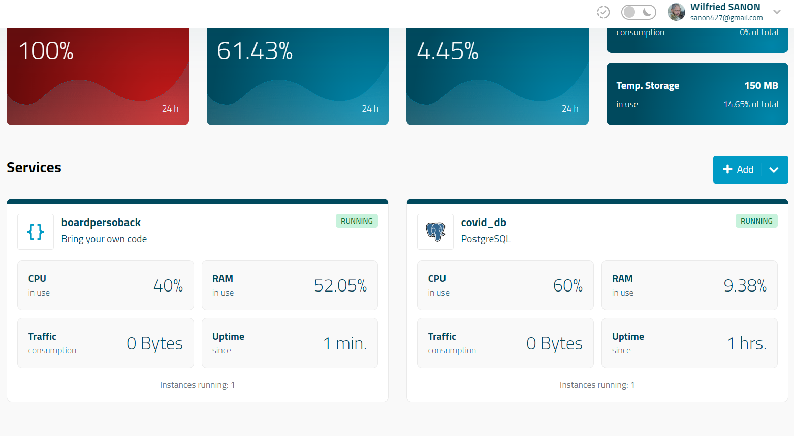
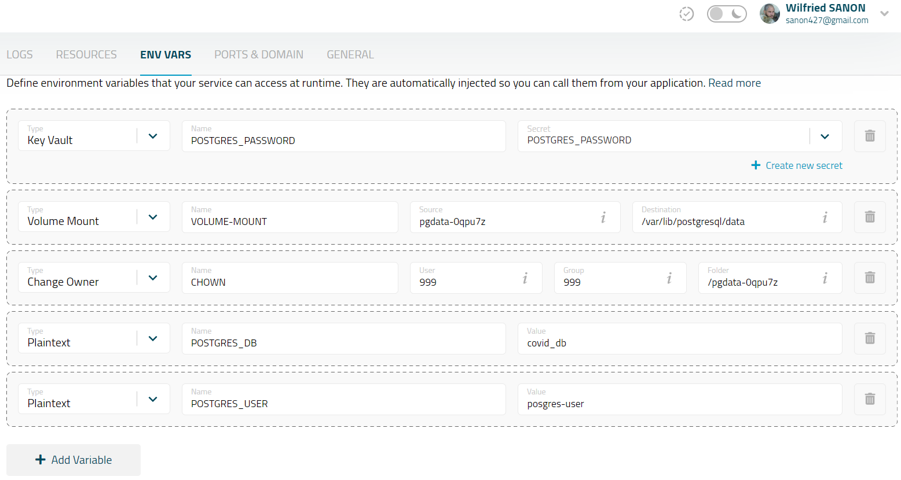
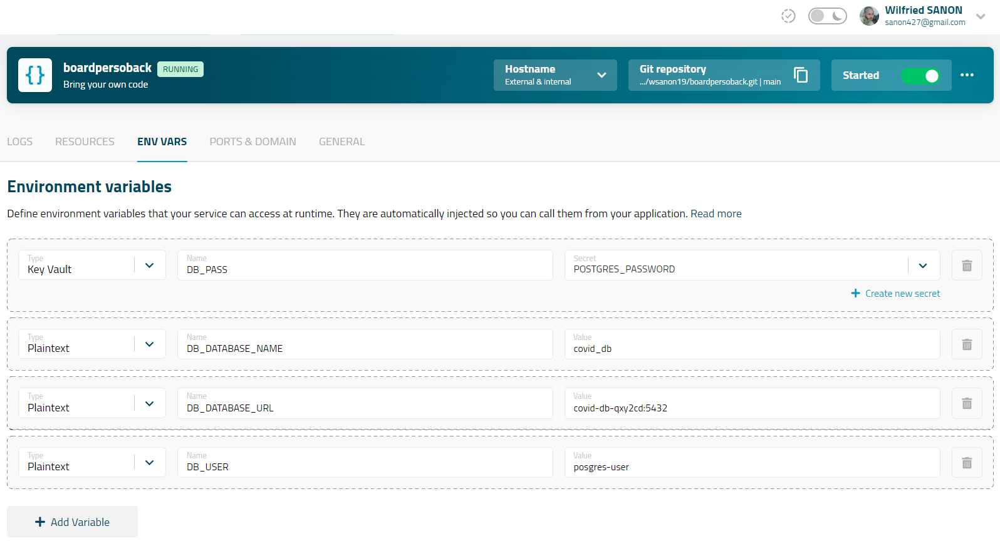

# Board_Perso_Back

## API (SpringBoot) + db PostgreeSQL 

Ceci est l'API d'un de mes projets perso, une application présentant mes projets réalisés. 

Dépot git : `https://github.com/wsanon19/boardpersoback.git`

Lien de déploiement mogenius : `https://boardpersoback-prod-wilfried-bf-8a0qur.mo2.mogenius.io/`

### Documentation de l'API avec open-api / Swagger 

* Lien de déploiement vers swagger : `https://boardpersoback-prod-wilfried-bf-8a0qur.mo2.mogenius.io/swagger-ui/index.html`

* Lien vers fichier JSON : `https://boardpersoback-prod-wilfried-bf-8a0qur.mo2.mogenius.io/v3/api-docs`

## Endpoints fonctionnels de l'API  : 

- Afficher la liste des projets : 
    - Type de la requete : GET 
    - Chemin : `.../api/projet/list`

- Ajouter un projet dans la db :
    - Type de la requete : POST
    - chemin : `.../api/projet/save`
    - Body attendu (un projet) : 
        {
            "id": 2,
            "nom": "Dev Full Stack ",
            "description": "Ceci est le projet sur le cloud"
        }

- Swagger : (voir ci-dessus)


## Mobogenius 

**Services crées**  



J'ai crée deux services :

* boardpersoback : image crée à partir du dépot git `https://github.com/wsanon19/boardpersoback.git`

* covid_db : image créé à partir du service préconfiguré postgresql fournie par mobogenius


### covid_db  

Il s'agit de l'image de la base de donnée postgre créee avec les variables d'environnements suivants: 




### boardpersoback  

Il s'agit du service sur lequel tourne le  conteneur de l'API. Cette API communique avec la base de donnée sur le conteneur covid_db.
Afin de réaliser la connection à la base de données : 

* Configuration du fichier application.properties :

```

spring.datasource.url=jdbc:postgresql://${DB_DATABASE_URL}/${DB_DATABASE_NAME}
spring.datasource.username=${DB_USER}
spring.datasource.password=${DB_PASS}
spring.jpa.hibernate.ddl-auto=create
spring.jpa.show-sql=true
spring.jpa.properties.hibernate.format_sql=true
spring.jpa.properties.hibernate.dialect=org.hibernate.dialect.PostgreSQL81Dialect

```
src/main/application.properties


* Configuration des variables d'environnements du conteneur : 




## Informations perso 
### Nom : SANON Wilfried
### Numéro étudiant : 31828632

